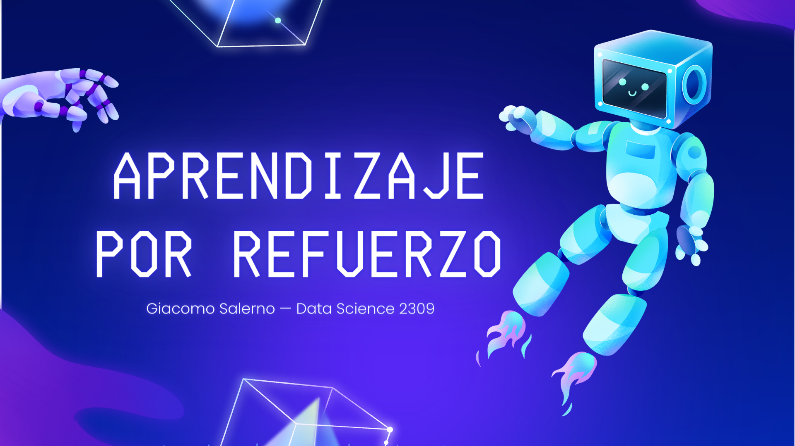

# Aprendizaje por Refuerzo

Este repositorio contiene material teórico y práctico para la clase de aprendizaje por refuerzo de Data Science (DS2309). El objetivo es proporcionar a los estudiantes una comprensión sólida de los fundamentos del aprendizaje por refuerzo y permitirles aplicar estos conceptos mediante ejemplos prácticos.

## Contenido

1. **Teoría**
   - **¿Qué es el Aprendizaje por Refuerzo?**
     - Definición y conceptos fundamentales.
     - Breve historia del aprendizaje por refuerzo.
   - **Diferencia con otros tipos de Aprendizaje Automático**
     - Supervisado y no supervisado.
     - Por qué es diferente.
   - **Aplicaciones Reales**
     - Casos prácticos y escenarios de uso.
   - **Conceptos Básicos**
     - Definiciones de elementos clave.
     - Definiciones de hiperparámetros.
     - Balance de epsilon.
   - **Tipos de Algoritmos**
     - Enfoque en Q-Learning y SARSA.

2. **Práctica**
   - **Ejemplo de Q-Learning**
     - Implementación simple.
   - **Uso de Blackjack en Gymnasium**
     - Aplicación práctica en un entorno estándar.
   - **Ejemplo de SARSA en Frozen Lake**
     - Abordaje de un problema más complejo.

3. **Extras**
   - **Entorno y Agente Personalizado**
     - ¡Aquí puedes jugar un rato!
     - Creación de un entorno y agente propios.
     - Espacio de experimentación.

## Requisitos

- Python 3.11.4
- Bibliotecas: Gymnasium, Matplotlib, NumPy, Pandas, PyGame, Seaborn, tqdm.

## Instrucciones de Uso

1. Clona este repositorio:

   ```bash
   git clone https://github.com/GiamoSalerno/aprendizaje_por_refuerzo.git

2. Instala las dependencias:
    ```bash
    pip install -r requirements.txt

3. Explora las carpetas teoria y practica para acceder al material teórico y los ejemplos prácticos.

4. ¡Disfruta aprendiendo y experimentando con el aprendizaje por refuerzo!

# Autor

Ciro Giacomo Salerno Escuela
